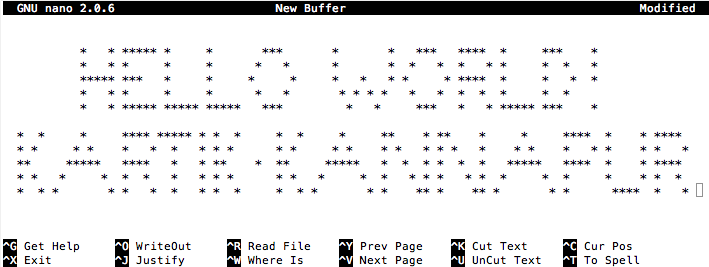

I am a Data Enthusiast with a background in Web development, Python and Community Management. I also have a degree in Electronics and Communication Engineering from PESIT, Bangalore. I have been a part of multiple communities such as Google Developer Group (GDG) Bangalore, IEEE and TEDx. I also blog at <a href="http://singlequote.wordpress.com/">SingleQuote</a>.

Feel free to reach out to me at <a href="mailto:kartikkannapur@gmail.com">kartikkannapur@gmail.com</a>

#####Disclaimer : The opinions expressed in this blog are my own and in no way related to my employer in any form.