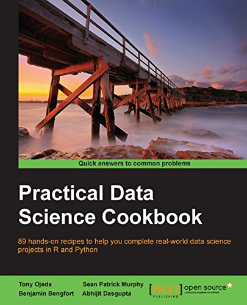

The Practical Data Science Cookbook authored by Tony Ojeda, Sean Patrick Murphy, Benjamin Bengfort and Abhijit Dasgupta is an amazing resource for every aspiring data scientist. If you are inclined to understand concepts through hands-on, real world examples, this cookbook is the ideal partner for you. 

The authors of the book have followed a methodical approach, to guide the reader through the entire data science pipeline - from acquiring and preparing the dataset to building statistical models to solve problem statements. The book contains eleven chapters, each of which is a data science project in itself. Furthermore, the authors have broken down each project into smaller, solvable problem statements and build it up from there. The cookbook also covers a variety of domains such as - automobile, sports, stock market etc. which gives the reader a great deal of exposure, to apply the concepts learnt in different verticals.

The book requires prior knowledge of Python and R, both of which are invaluable for every data scientist and are easy to learn. In addition the recipes in the book, also use a plethora of open source libraries and data sets, which the reader can get acquainted with.

To purchase a copy of the book, visit [Packt Publishing](https://www.packtpub.com/big-data-and-business-intelligence/practical-data-science-cookbook).